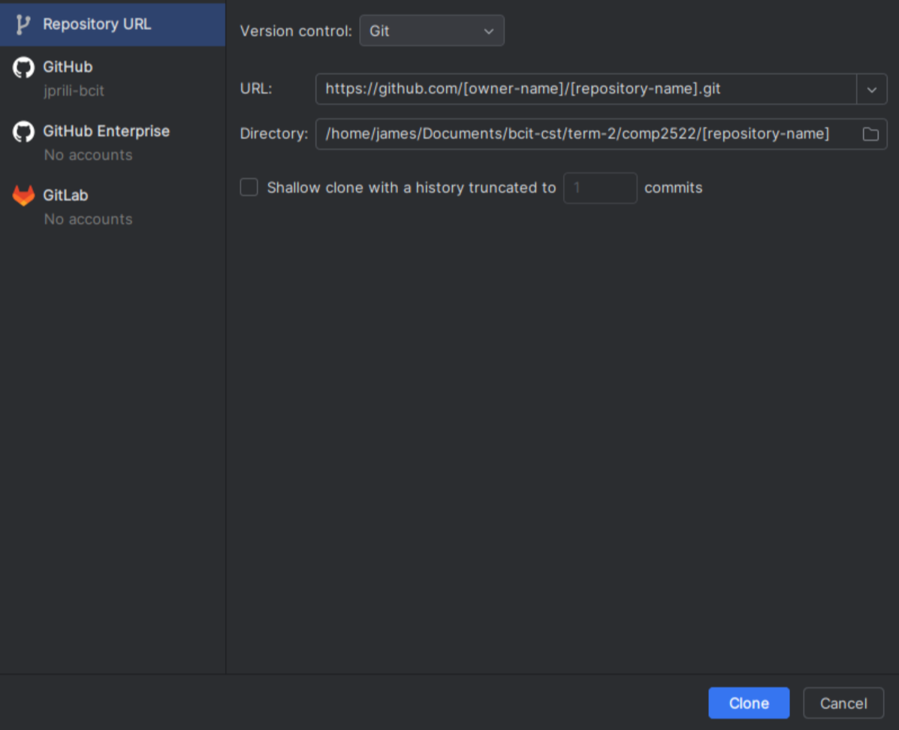

Cloning to the Local Machine
==
## Overview
Cloning is essentially creating a copy of the repository hosted somewhere else,
in this case GitHub, to the local machine.
It enables tracking and synchronisation of the hosted version and the local version.

This page contains the steps to clone a GitHub repository.
It covers cloning via the terminal or a JetBrains IDE.
By the end of the page, you should be able to modify and
extend the repository locally.

## In Your Browser
1. **Go** to the desired repository in GitHub.
   The URL of the browser must be in the following format:
   ```
   https://github.com/[owner-name]/[repository-name]
   ```
   If you would like to create your own repository or fork an existing one, see [Creating a New Repository](creating_repository.md) 
   and [Forking an Existing Repository](forking_repository.md).
2. In the repository page, **click** the green "<\> Code" button. A dropdown should pop showing options for cloning.
3. Focusing on the "Local" option.
4. **Click** on "HTTPS".

    {: style="height:80%;width:80%;align:center"}

5. **Copy** the URL to your clipboard by clicking :octicons-copy-16: or pressing *Ctrl+C* (Windows, Linux) or *:material-apple-keyboard-command:+C* (MacOS).
6. **Open** a terminal in the directory for the local copy's destination.
7. Copy the link into your clipboard.

!!! note

    If you are cloning `repository-name` 
    into the `destination` directory,
    the resulting file structure will be
    `destination/repository-name`

## In Your Local Computer

=== "via the terminal"

    8. **Open** a terminal in the parent directory that you want to clone into.
    9. In the terminal, **type** `git clone`.
    10. **Paste** the URL into the terminal. The full command should look like the following:
        ```zsh
        git clone https://github.com/[owner-name]/[repository-name].git
        ```
    11. **Press** *Enter*.

=== "via a JetBrains IDE"

    8. **Close** the current project by clicking  :material-menu: > "File" > "Close Project". This should take you into the home page.
    9. **Click** "Projects" > "Clone Repository".

        {: style="width:90%;height:90%"}
    10. **Paste** the URL into the top text bar.

        {: style="width:85%;height:85%"}
    11. **Press** *Enter* or **click** "Clone" to proceed to cloning.

!!! success
    
    A copy of the repository under 
    should now appear in the directory
    the repository is cloned into.

## Conclusion
In this page, you have learned how to clone a repository
using the terminal or a JetBrains IDE.
The repository should now be open for modification or extension
in your computer. 
To submit changes into GitHub, see
[Pushing commits to a remote repository](https://docs.github.com/en/get-started/using-git/pushing-commits-to-a-remote-repository) from the official GitHub docs.
