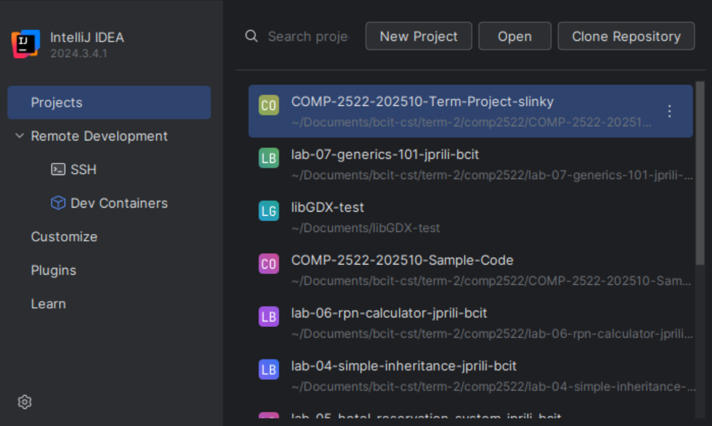

Cloning to the Local Machine
==
## Overview
This page contains the steps to clone a GitHub repository.
It covers cloning via the terminal or a JetBrains IDE.

## Steps
1. Go to the desired repository on the browser.
   The URL of the browser must be in the following format:
   ```
   https://github.com/[owner-name]/[repository-name]
   ```
   If you would like to create your own repository or fork an existing one, see [Creating a New Repository](creating_repository.md) 
   and [Forking an Existing Repository](forking_repository.md).
2. On the repository page, **Click** the green "<\> Code" button. A dropdown should pop showing options for cloning.

    {: style="height:80%;width:80%;align:center"}

3. Focusing on the "Local" option, there are three choices: we can clone via "HTTPS", "SSH", or "Github CLI". Choose "HTTPS".
4. Copy the URL to your clipboard by clicking :octicons-copy-16:.
5. Open a terminal in the directory for the local copy's destination.

!!! note

    If you are cloning `repository-name` 
    into the `destination` directory,
    the resulting file structure will be
    `destination/repository-name`

5. Copy the link into your clipboard.

=== "via the terminal"

    6. Open a terminal into the parent directory that you want to clone into.
    7. In the terminal, type the following
        
        ```zsh
        git clone [desired-repository]
        ```
        and press Enter.

=== "via a JetBrains IDE"

    6. Close the current project by Clicking  :material-menu: > "File" > "Close Project". This should take you into the home page.
    7. Click "Projects" > "Clone Repository".

        {: style="width:90%;height:90%"}

       Otherwise, 
    7. 


!!! success
    
    A copy of the repository under 
    should now appear in the directory
    the repository is cloned into.

## Conclusion
In this page, you have learned how to clone a repository
using the terminal or a JetBrains IDE.
The repository should now be open for modification or extension
in your computer. 
To submit changes into GitHub, see
[Pushing commits to a remote repository](https://docs.github.com/en/get-started/using-git/pushing-commits-to-a-remote-repository) from the official GitHub docs.
