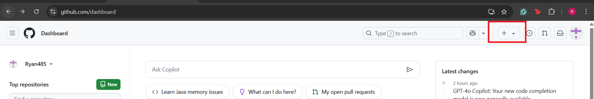
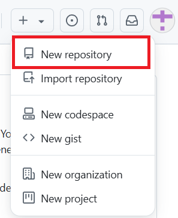
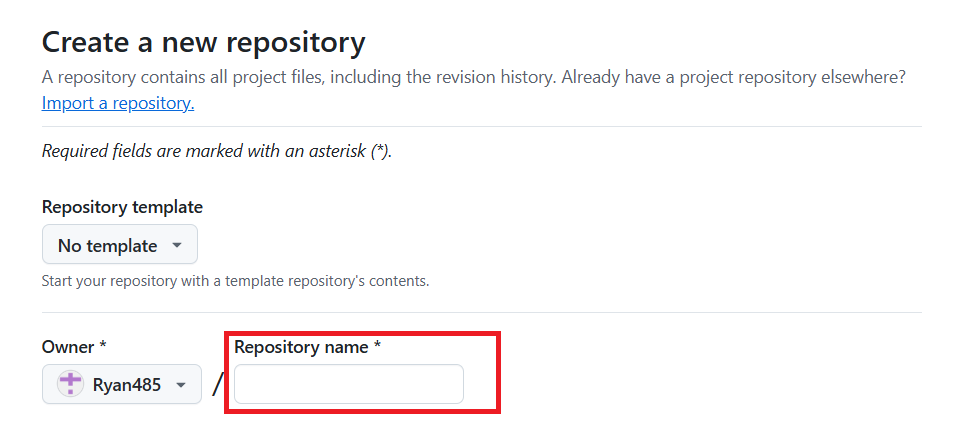
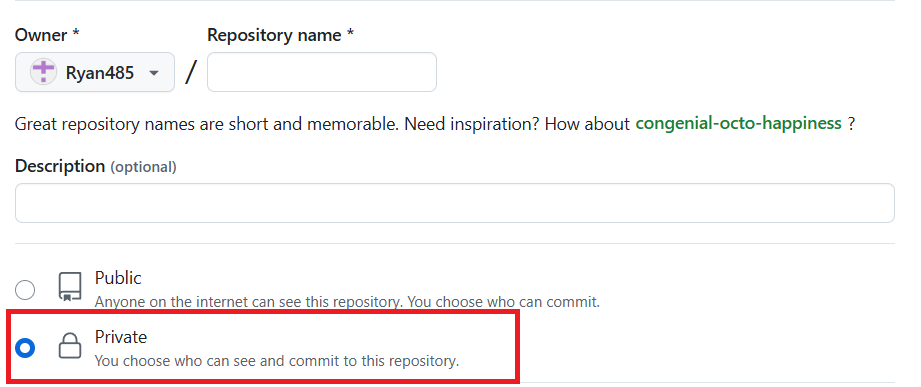
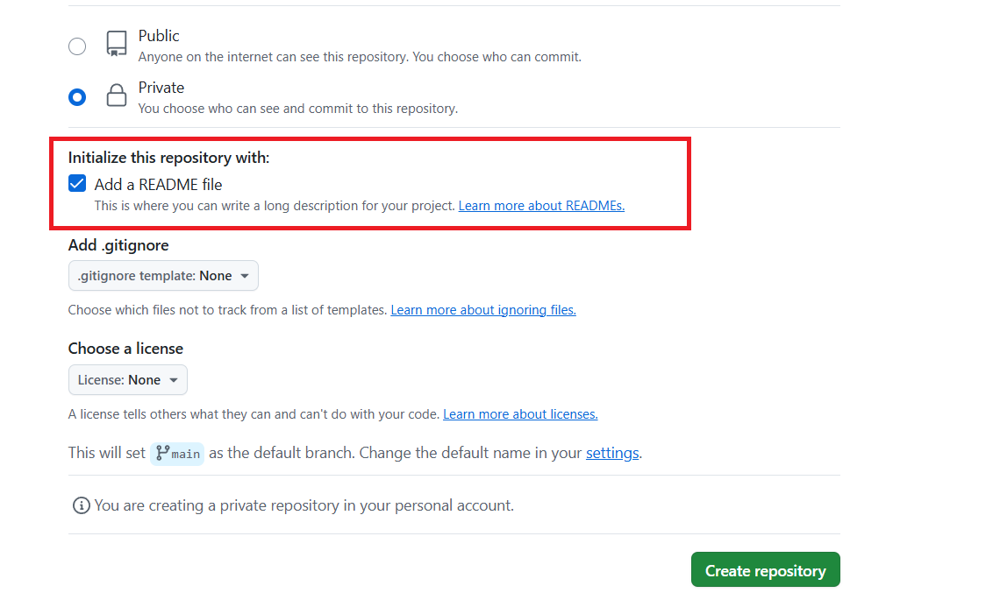
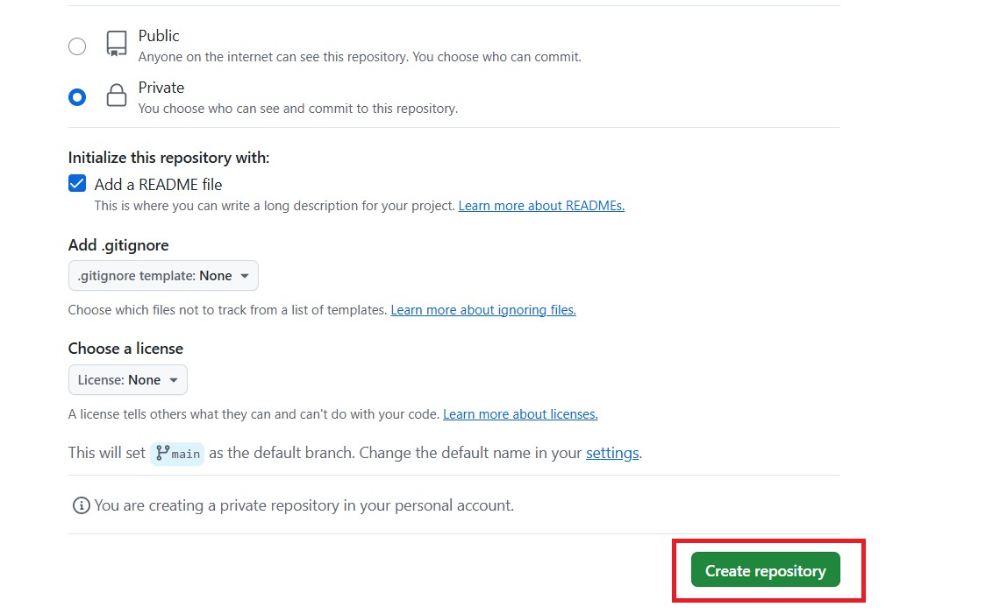
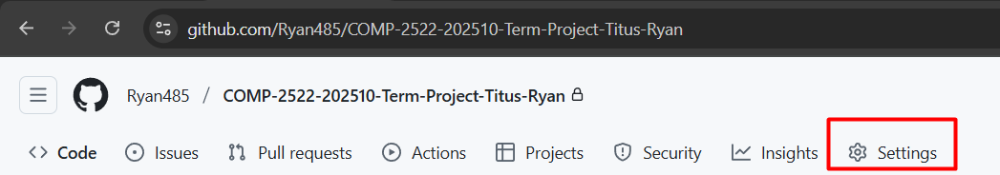
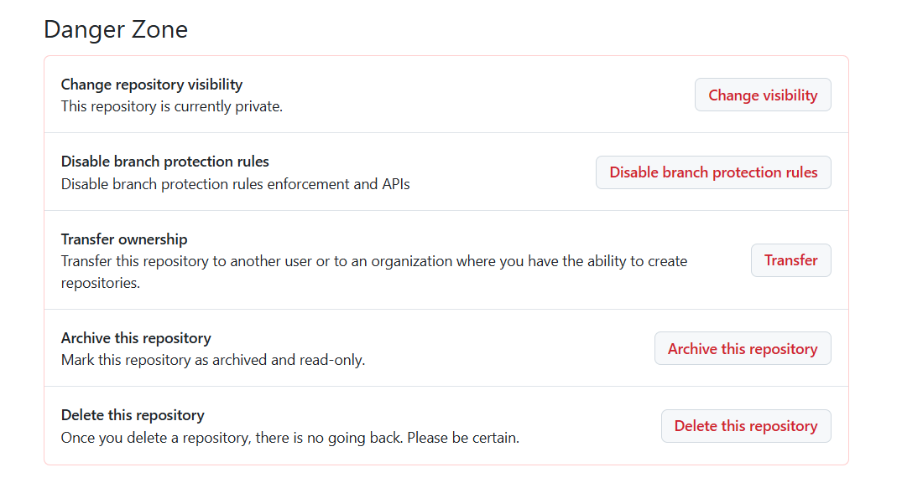
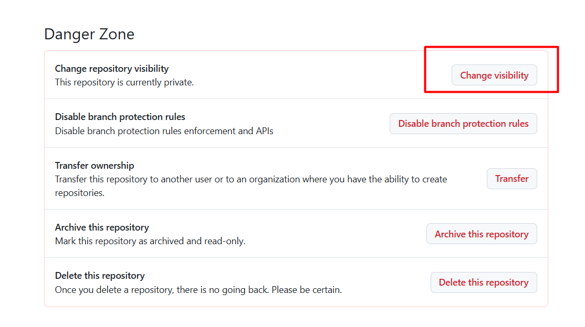
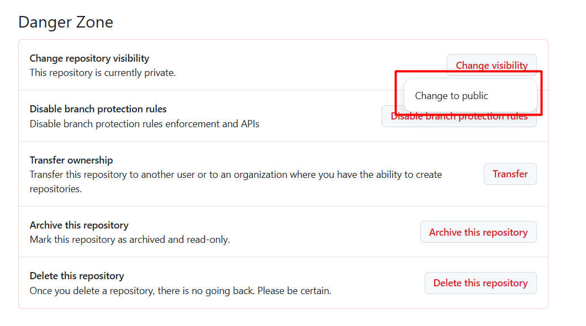

Creating Repository
==

## Overview
This page contains the steps to create a GitHub repository.

## How to create a repository
1. Go to Github following the link below:
   ```
   https://github.com

   ```

2. Once you are on Github, go to the top right corner and **Click** on the '+' sign:

    {: style="height:100%;width:150%;align:center"}

3. **Click** on New repository

    {: style="height:200px;width:200px;align:center"}

4. Set your repository name under **Repository name**
    {: style="height:50%;width:80%;align:center"}

5. Set your repository to **Private**.
    {: style="height:80%;width:100%;align:center"}

!!! note

    Unless you want to share your code with others, it is generally recommended to set your repository **Private**. You can always change it to **Public** when needed.

    If you need a guide on how to change your **Private** repository to **Public**, check 'How to change it to public?' section below.

=== "Next Step"
    6. Check 'Add a README file'

    {: style="height:80%;width:100%;align:center"}


    !!! note
        It is recommended to include README file on your project as it provides essential information for users to understand what your project does, how to use it, and any other relevant details

    7. Click on **Create repository**

        {: style="height:80%;width:100%;align:center"}


    !!! success
        Your new repository is successfully created.


=== "How to change it to public?"

    1. Navigate to the repository you’d like to switch from public to private.

    2. Go to settings
        {: style="height:80%;width:100%;align:center"}

    3. In the settings, scroll down to the bottom until you find the Danger Zone section.

        {: style="height:80%;width:100%;align:center"}

    4. Click on **Change visibility**
    
        {: style="height:80%;width:100%;align:center"}

    5. Click on **Change to public**

        {: style="height:80%;width:100%;align:center"}

    !!! success
        Private repository is now changed to public.


