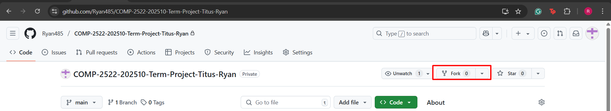
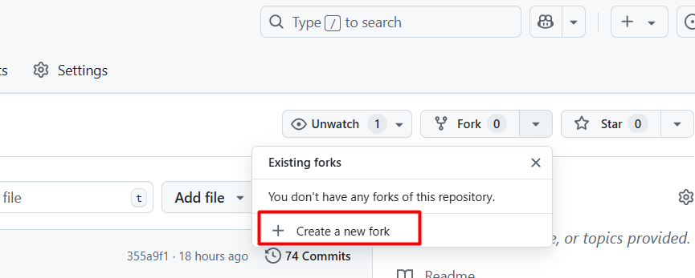
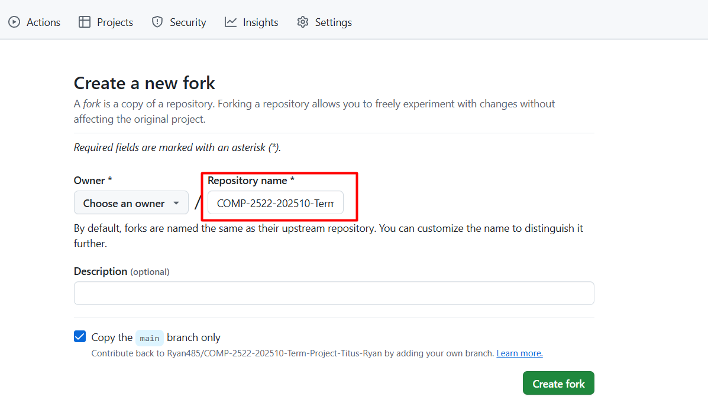
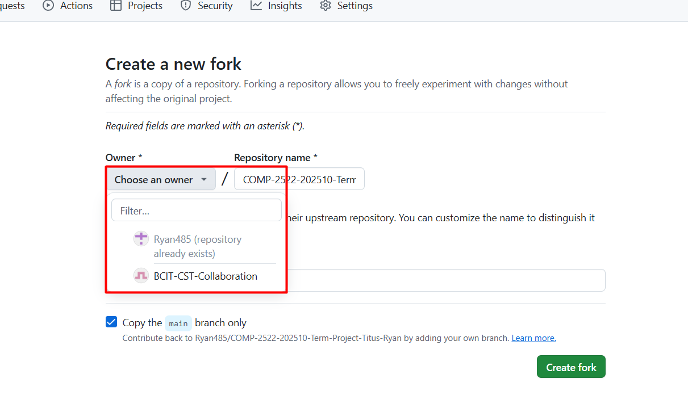
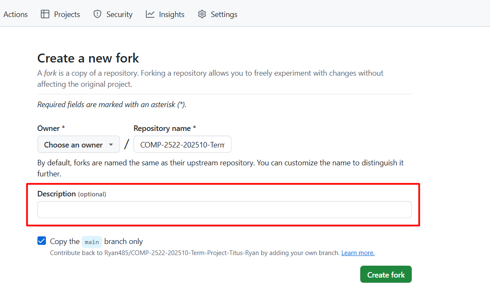
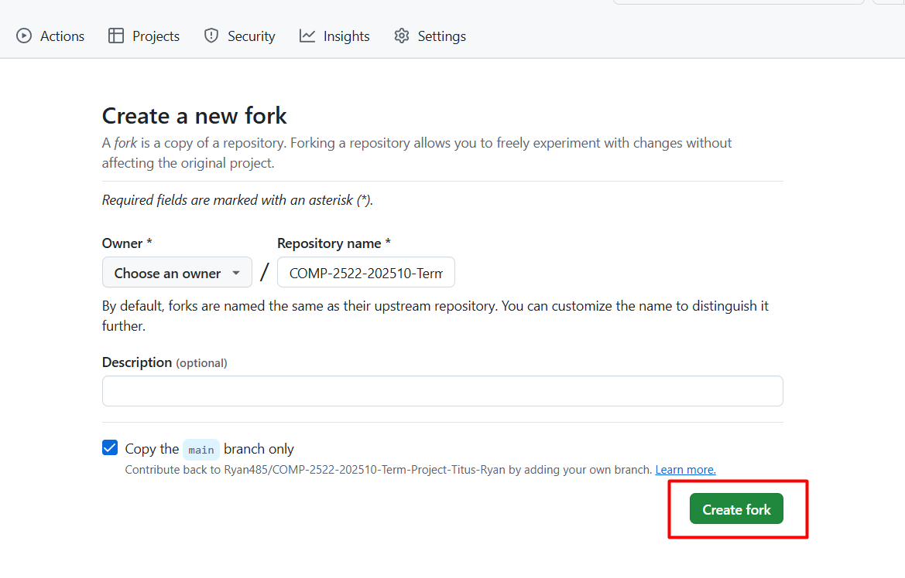
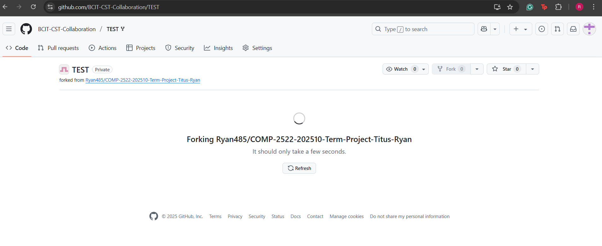
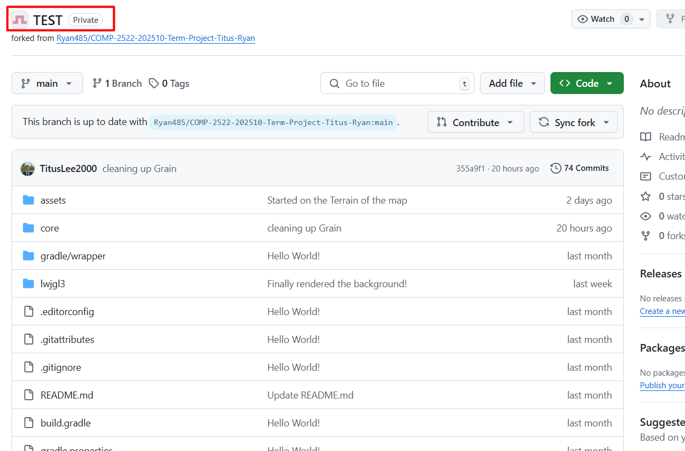

Fork a Repository
==

## Overview
Just as you’d fork a piece of food to pick it up, you can fork someone else’s repository to create your own copy.
It allows you to modify the code without affecting the original repository, giving you freedom to experiment it as much as you can.

This page helps you how to fork a repository.

1. **Go** to the desired repository in GitHub.
   The URL of the browser must be in the following format:
   ```
   https://github.com/[owner-name]/[repository-name]
   ```

2. Navigate to the repository you want to fork from.

3. **Click** on 'Fork'.

    {: style="height:100%;width:150%;align:center"}

4. **Click** on 'Create a new fork'.

    {: style="height:100%;width:150%;align:center"}

5. After step 3, you’ll see that the repository name is automatically set to the original name. You can adjust it to something that better fits your needs.

    {: style="height:100%;width:150%;align:center"}

6. Under "Owner", click an owner for the forked repository.

    {: style="height:100%;width:150%;align:center"}

7. You can also include an optional description for additional context.

    {: style="height:100%;width:150%;align:center"}

8. **Click** on 'Create fork'

    {: style="height:100%;width:150%;align:center"}

9. You will be redirected to this page while the repository is being forked to your GitHub account.

    {: style="height:100%;width:150%;align:center"}

10. The repository has been successfully forked.

    {: style="height:100%;width:150%;align:center"}


!!! success
    The repository has been successfully forked.


## Conclusion
In this page, you have learned how to fork someone else's repository. Forking gives you the freedom to experiment and modify the code without affecting the original project, enabling you to work independently or contribute back via pull requests. With your fork successfully created, you can now make changes locally, push commits to your fork, and collaborate further. For more detailed guidance, refer to the  [How to fork a repository](https://docs.github.com/en/pull-requests/collaborating-with-pull-requests/working-with-forks/fork-a-repo) on the offical GitHub website.

